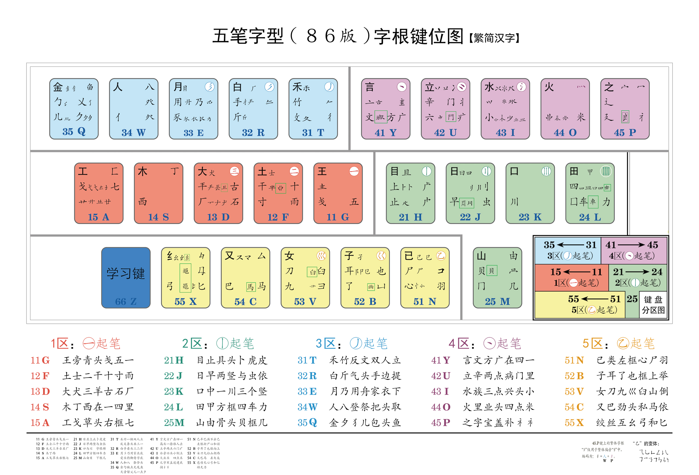

# 本地rime配置文件默认地址

- Windows
  - Weasel: `%APPDATA%\Rime`
- Mac OS X
  - Squirrel: `~/Library/Rime`
  - Fcitx5 macOS: `~/.local/share/fcitx5/rime`
- Linux
  - iBus:`~/.config/ibus/rime`
  - Fcitx5: `~/.local/share/fcitx5/rime`
- Fctix5 Android(小企鹅入法): `/storage/emulated/0/Android/data/org.fcitx.fcitx5.android/files/data/rime/


# 五笔+万象拼音说明

* 支持Unicode 15.1.0 CJK 超大字符集
* 支持86/98五笔拆字提示
* 支持输出各个键位对应字根
* 支持拼音反查五笔，五笔反查拼音
* 支持计算器，农历，节气
* 支持cjk字符集过滤
* 支持cjk码区提示
* 支持emoji输出
* 支持各种符号输出

## 功能键

| 功能键  | 功能                |
| ---- | ----------------- |
| date | 显示当前日期            |
| time | 显示当前日期+时间         |
| week | 显示当前星期            |
| nl   | 显示当前农历            |
| jq   | 显示当前二十四节气         |
| 键名+z | 显示该键位字根           |
| `    | 以形查音              |
| Up   | 拼音反查              |
| z    | 重复上次上屏内容          |
| =    | 激活计算器功能和大小写金额转换功能 |
| R    | 激活数字大写功能          |

Tips: 要想在正常输入状态下开启码元提示只需修改`wubi86.schema.yaml`或`wubi98.schema.yaml`如下字段为:

```
chaifen:
  opencc_config: wb86(98)_spelling.json
  option_name: chaifen
  show_in_comment: true 
  comment_format:     
    - "xform/&nbsp;/ /"
  tags: [abc, pinyin_lookup]            # 限制在对应 tag 才有拆分提示
  tips: all                             # 只给单字加滤镜，改为 char 。 词也显示，改为 all
```

另：为进一步提高开启码元提示时的读取速度，把拆分码元的字表转换为ocd2格式。转换方法如下：

1. 安装opencc: ```brew install opencc```
2. 终端输入命令: ```opencc_dict -i /path/wb86_spelling.txt -o /path/wb86_spelling.ocd2 -f text -t ocd2```

## 补充资料

### 86 版五笔字根表



### 98 版五笔字根表


| 横区            | 竖区        | 撇区        | 点区        | 折区        |
| ------------- | --------- | --------- | --------- | --------- |
| G 王旁青头五夫一     | H 目上卜止虎具头 | T 禾竹反文双人立 | Y 言文方点谁人去 | N 已类左框心尸羽 |
| F 土干十寸未甘雨,革字底 | J 日早两竖与虫依 | R 白斤气丘叉手提 | U 立辛六羊病门里 | B 子耳了也乃框皮 |
| D 大犬戊其古石厂     | K 口流川,码元稀 | E 月用力豸毛衣臼 | I 水族三点鳖头小 | V 女刀九良山西倒 |
| S 木丁西甫        | L 田甲方框四车里 | W 人八登头单人几 | O 火业广鹿四点米 | C 又巴牛入马失蹄 |
| A 工戈草头右框七     | M 山由贝骨下框集 | Q 金夕鸟儿犭边鱼 | P 之字宝盖补示衣 | X 幺母贯头弓和匕 |

## 参考来源

1. [万象拼音](https://github.com/amzxyz/rime_wanxiang)
2. [五笔小筑](https://github.com/yanhuacuo/98wubi)
3. [空山明月五笔](https://github.com/mrshiqiqi/rime-wubi)
4. [86五笔极点码表](https://github.com/KyleBing/rime-wubi86-jidian)
5. [薄荷输入法](https://github.com/Mintimate/oh-my-rime)
6. [Rime 输入法双拼加辅助码方案](https://github.com/boomker/rime-fast-xhup)
7. [五笔字型超大字符集编码数据库](https://github.com/CNMan/UnicodeCJK-WuBi)

## Unicode CJK 部分变动历史：

| 版本     | 发布年月    | CJK       | CJK-A     | CJK-B       | CJK-C       | CJK-D       | CJK-E       | CJK-F       | CJK-G       | CJK-H       | CJK-I       | CJK-CI    | CJK-CIS     |
| ------ | ------- | --------- | --------- | ----------- | ----------- | ----------- | ----------- | ----------- | ----------- | ----------- | ----------- | --------- | ----------- |
| 码位     |         | 4E00-9FFF | 3400-4DBF | 20000-2A6DF | 2A700-2B73F | 2B740-2B81F | 2B820-2CEAF | 2CEB0-2EBEF | 30000-3134F | 31350-323AF | 2EBF0-2EE5F | F900-FAFF | 2F800-2FA1F |
| 码数     |         | 20,992    | 6,592     | 42,720      | 4,160       | 224         | 5,776       | 7,488       | 4,944       | 4,192       | 624         | 512       | 544         |
| 1.0.1  | 1992.06 | 20,902    |           |             |             |             |             |             |             |             |             | 302       |             |
| 3.0.0  | 1999.09 |           | 6,582     |             |             |             |             |             |             |             |             |           |             |
| 3.1.0  | 2001.03 |           |           | 42,711      |             |             |             |             |             |             |             |           | 542         |
| 3.2.0  | 2002.03 |           |           |             |             |             |             |             |             |             |             | 361       |             |
| 4.1.0  | 2005.03 | 20,924    |           |             |             |             |             |             |             |             |             | 467       |             |
| 5.1.0  | 2008.04 | 20,932    |           |             |             |             |             |             |             |             |             |           |             |
| 5.2.0  | 2009.10 | 20,940    |           |             | 4,149       |             |             |             |             |             |             | 470       |             |
| 6.0.0  | 2010.10 |           |           |             |             | 222         |             |             |             |             |             |           |             |
| 6.1.0  | 2012.01 | 20,941    |           |             |             |             |             |             |             |             |             | 472       |             |
| 8.0.0  | 2015.06 | 20,950    |           |             |             |             | 5,762       |             |             |             |             |           |             |
| 10.0.0 | 2017.06 | 20,971    |           |             |             |             |             | 7,473       |             |             |             |           |             |
| 11.0.0 | 2018.06 | 20,976    |           |             |             |             |             |             |             |             |             |           |             |
| 13.0.0 | 2020.03 | 20,989    | 6,592     | 42,718      |             |             |             |             | 4,939       |             |             |           |             |
| 14.0.0 | 2021.09 | 20,992    |           | 42,720      | 4,153       |             |             |             |             |             |             |           |             |
| 15.0.0 | 2022.09 |           |           |             | 4,154       |             |             |             |             | 4,192       |             |           |             |
| 15.1.0 | 2023.09 |           |           |             |             |             |             |             |             |             | 622         |           |             |

GBK 基本相当于 Unicode 1.0.1；GB18030－2000 基本相当于 Unicode 3.0.0；GB18030－2005 基本相当于 Unicode 3.1.0；GB18030－2022 基本相当于 Unicode 11.0.0。

```
总码数：20,992+6,592+42,720+4,160+224+5,776+7,488+4,944+4,192+624+512+544=98,768
总字数：20,992+6,592+42,720+4,154+222+5,762+7,473+4,939+4,192+622+472+542=98,682
```
